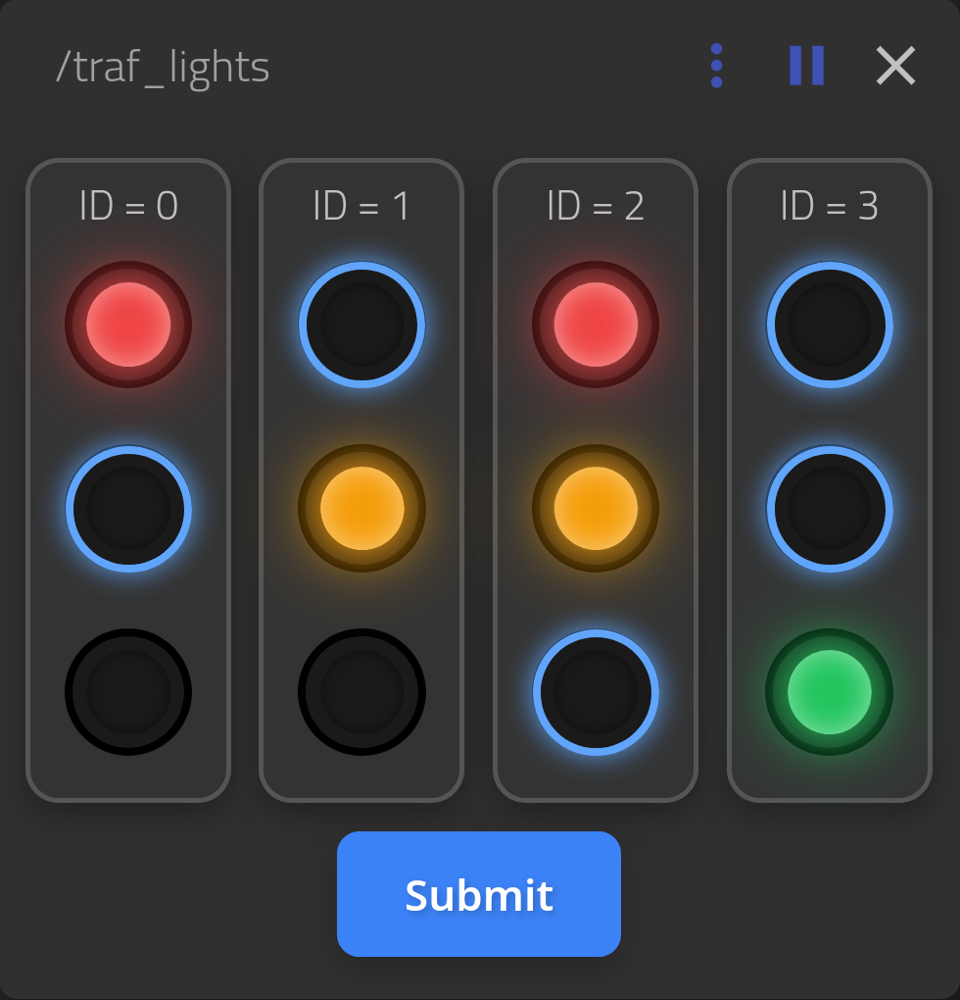

Server
======

This part of the project contains code for the server, that will control traffic lights,
take photos of of current traffic situation and work as a communication node for all robots.

This document provides instructions for setting up and using our ROS2 project, which leverages `rosboard <https://github.com/LosVocelos/rosboard>`_ for web-based visualization.
We have extended rosboard with custom viewers and introduced custom interfaces/messages tailored for our project's specific needs.

.. contents::
    :depth: 2
    :local:

Installation
------------

To get started with the project, you need to have ROS2 installed and then clone this repository.

Install ROS2:

If you don't have ROS2 installed, please follow the official `ROS2 installation guide <https://docs.ros.org/en/iron/Installation.html>`_ for your operating system.

.. note::

   The project is being developed and tested on ROS Iron, nut there should be no problem running it with any newer version.

Clone the Repository:

Clone this project's repository, make sure to include its submodules, which contain necessary dependencies, now only rosboard.

.. code-block:: console

   $ git clone --recurse-submodules https://github.com/LosVocelos/Lampone2025.git
   $ cd Lampone2025

Running the Project
-------------------

After successfully installing ROS2 and cloning the repository, you need to build the ROS2 workspace and then launch the web visualization tool.

Build the ROS2 Workspace:
Navigate to your ROS2 workspace root (the directory you cloned) and build it using colcon:

.. code-block:: console

   $ cd <your_projects_directory>/Lampone2025
   $ colcon build
   $ source install/setup.bash

Once the build is complete, you can run the web visualization tool:

.. code-block:: console

   $ ros2 launch tools/main_web.xml

This command will start the rosboard server and make the web interface accessible.

Usage
-----

After running the main_web.xml launch file, you can access the web visualization and interact with your ROS2 topics.

General ROSboard usage
^^^^^^^^^^^^^^^^^^^^^^

1. Open your web browser and navigate to: http://localhost:8888. You should see the rosboard interface.

2. On the left side of the rosboard interface, you will find a menu. Click on it to expand the options.

3. Within the menu, you can see a list of available ROS2 topics.
   Click on the topics you wish to visualize to subscribe to them.
   Rosboard will automatically display the data in appropriate viewers (e.g., plots for numerical data, text for string messages, etc.).

.. note::
   For more information about ROSboard, refer to its `official github repository <https://github.com/dheera/rosboard>`_.

   However, this project uses customized version of ROSboard accessible here: `LosVocelos/rosboard <https://github.com/LosVocelos/rosboard>`_

Custom Viewers Usage
^^^^^^^^^^^^^^^^^^^^

This project includes custom viewers integrated into rosboard to display our unique message types and data structures.

Road Map Viewer
"""""""""""""""

For now, it only plots the map distributed by topic /road_map into a canvas, that you can zoom in/out and move.

.. note::
   There is another viewer for this topic, labeled "Rendered data", which prints out the distributed map using only ascii characters,
   but will never by updated, as it is not needed anymore.

Lights Data
"""""""""""

Viewer and publisher for the /traff_lights topic.

It automatically shows trafic light that are distributed by the server
and let's you override their status by clicking on the bulbs and submiting your chosen states to the topic.
The viewer then displays your changes, confirming, that the message was published successfully.

.. image:: img/ROSboard_traf_lights_3.png
   :width: 33%
   :align: right
